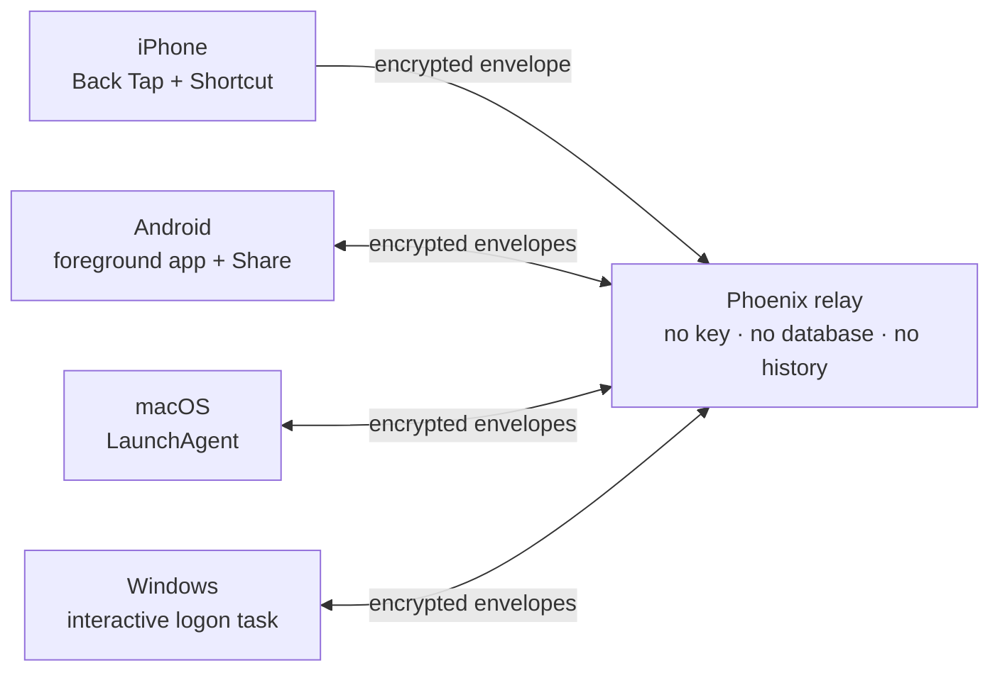

<div align="center">

# BatonPass

**An end-to-end encrypted clipboard bridge for iPhone, Android, macOS, and Windows.**

Copy a TOTP code, API key, or short piece of text on one device and paste it on
another. The relay moves opaque ciphertext, holds no key, and stores nothing.

</div>

> [!IMPORTANT]
> BatonPass is an experimental personal project, not a packaged consumer app.
> The macOS and Windows agents work end to end; the iOS sender builds, but its
> real-device signing and reliability matrix is still pending.

## Why BatonPass?

Apple's Universal Clipboard already handles Mac ↔ iPhone well. BatonPass adds
Windows without putting clipboard contents—or the key needed to decrypt them—on
the relay host.



The desktop agents watch the local clipboard and receive changes while logged
in. On iPhone, a Shortcut supplies clipboard text to an App Intent; the app does
not read `UIPasteboard`, avoiding a background pasteboard read and the associated
paste permission flow.

## Properties

- **End-to-end encrypted.** Agents use ChaCha20-Poly1305; the relay never sees
  plaintext or possesses the shared group key.
- **Tailnet-gated.** The relay resolves each peer with `tailscale whois`, rejects
  tagged nodes, and admits only explicitly allowlisted stable node IDs.
- **No history.** Delivery is online-only and best effort. The relay has no
  database, queue, catch-up path, or payload logging.
- **Replay-resistant.** Receivers authenticate, enforce epoch and freshness
  rules, durably deduplicate, and persist acceptance before writing a clipboard.
- **Loop-aware.** Received items are never forwarded again; the macOS agent also
  filters Universal Clipboard provenance before reading content.
- **Bounded.** Text payloads are capped at 65,536 bytes; malformed, oversized,
  stale, duplicate, or over-capacity input fails closed.

The wire format and its security invariants are specified in
[`crypto/SPEC.md`](crypto/SPEC.md). The relay's deliberately narrow contract is
in [`relay/CONTRACT.md`](relay/CONTRACT.md).

## Status

| Component | State |
|---|---|
| Shared Swift core | Implemented; 26 conformance vectors and 15 receiver tests |
| Phoenix relay | Implemented; opaque fan-out, allowlist gate, limits, health endpoint |
| macOS agent | Implemented and verified end to end over the tailnet |
| Windows agent | Implemented; 52 tests and live receive-to-clipboard verification |
| iOS sender | Builds for simulator and device; physical-device validation pending |
| Android client | Mac-to-Android copy/paste verified in emulator; physical-device tailnet validation pending |
| Enrollment UI / iOS receive | Not implemented |

See [`TASKS.md`](TASKS.md) for the detailed implementation record and remaining
work.

## Hosting and running

You need Tailscale on the relay and every participating device. Tailnet ACLs
must permit clients to reach the relay's TCP port. The examples below use port
`4000`, group `home`, and a different numeric sender ID for every device.

### 1. Host the relay

The relay must run directly on a tailnet host where `tailscale whois` can resolve
the real peer IP. Do not put it behind a normal reverse proxy or Docker bridge:
the relay would see the proxy/bridge address and reject every client.

Install Elixir 1.17+ and Tailscale, then collect:

- the relay's Tailscale IPv4 address (`tailscale ip -4`)
- the absolute path to the `tailscale` binary (`command -v tailscale`)
- your Tailscale account login
- each permitted device's `Node.StableID` from `tailscale whois --json <device-ip>`
- a persistent Phoenix signing secret generated once with `mix phx.gen.secret`

Pass those instance-specific values through the environment; do not commit them.
`BATONPASS_ALLOWED_STABLE_IDS` is a comma-separated list:

```sh
cd relay/app
mix setup
BATONPASS_BIND_IP="100.x.y.z" \
BATONPASS_TAILSCALE_BIN="$(command -v tailscale)" \
BATONPASS_OWNER_LOGIN="you@example.com" \
BATONPASS_ALLOWED_STABLE_IDS="nDEVICE1CNTRL,nDEVICE2CNTRL" \
SECRET_KEY_BASE="PASTE_THE_OUTPUT_OF_MIX_PHX_GEN_SECRET" \
MIX_ENV=dev \
PORT=4000 \
mix phx.server
```

From an allowlisted device, verify the identity gate and endpoint:

```sh
curl http://100.x.y.z:4000/health
```

Keep that command alive with the host's process supervisor and restart it after
configuration changes. Store `SECRET_KEY_BASE` in the supervisor's private
environment, never in the repository; changing it invalidates Phoenix-signed
cookies and tokens. Logs may contain connection metadata and frame sizes, but
never frame contents.

> [!WARNING]
> Production runtime enrollment configuration is not implemented yet. The
> working environment-variable configuration currently lives in `dev.exs`, so
> `MIX_ENV=prod` and `mix release` are not supported deployment paths.

### 2. Install the macOS agent

Run this from a normal logged-in macOS session, not over SSH:

```sh
BATONPASS_RELAY_HOST="100.x.y.z:4000" \
BATONPASS_GROUP=home \
BATONPASS_SENDER=1 \
./install/macos/install.sh
```

The installer builds the agent, verifies the shared conformance vectors, sets up
the group key, and registers a LaunchAgent. It also prints this Mac's
`StableID`; add it to the relay allowlist and restart the relay.

```sh
tail -f ~/Library/Logs/BatonPass/batonpass.log
launchctl kickstart -k gui/$(id -u)/co.subvisual.batonpass
```

If this is the first device, generate the group key when prompted. Otherwise,
import the existing 64-character hex key out of band. Never send the group key
through BatonPass itself.

### 3. Install the Windows agent

Publish the binary on a machine with the .NET 10 SDK:

```sh
dotnet publish agents/windows/src/BatonPass.Windows.Agent/BatonPass.Windows.Agent.csproj \
  -c Release -r win-x64 --self-contained true -o publish/windows
```

Copy the published files to `C:\BatonPass`, then open a normal PowerShell window
on the Windows desktop. Do not install or recover the agent over SSH, and do not
run the recovery command as Administrator: the agent must own its state with the
same limited user token used by its scheduled task.

Import the group key explicitly:

```powershell
C:\BatonPass\batonpass-agent.exe import-key `
  --key "YOUR_64_HEX_GROUP_KEY" `
  --relay "ws://100.x.y.z:4000/socket/websocket?vsn=2.0.0" `
  --group home --sender-id 2 --epoch 1
```

Register and start the interactive logon task:

```powershell
.\install\windows\install.ps1 `
  -RelayHost "100.x.y.z:4000" `
  -Group home `
  -SenderId 2
```

The installer prints the Windows node's `StableID`; add it to the relay
allowlist and restart the relay. Useful operating commands:

```powershell
C:\BatonPass\batonpass-agent.exe status
Get-ScheduledTask -TaskName BatonPass
Start-ScheduledTask -TaskName BatonPass
Stop-ScheduledTask -TaskName BatonPass
```

For foreground diagnostics, stop the scheduled task and run
`C:\BatonPass\batonpass-agent.exe run` from that same desktop PowerShell. A
service, SSH session, or logged-out machine has no access to the user's visible
clipboard.

### 4. Build the iOS sender

Install XcodeGen, generate the Xcode project, and open it:

```sh
cd agents/ios
xcodegen generate
open BatonPass.xcodeproj
```

Select a signing team, install the app on the iPhone, then enter the relay as
`<relay-tailnet-ip>:4000`, group `home`, a unique sender ID, and the same group
key. In Shortcuts, create:

1. **Get Clipboard**
2. **Text** using the clipboard result—this preserves leading-zero TOTP codes
3. **Send to BatonPass** using that text

Assign the shortcut under **Settings → Accessibility → Touch → Back Tap**.
The iOS path is send-only and still awaits physical-device reliability testing.

### 5. Build the Android client

Install JDK 17 and Android SDK Platform 35, then:

```sh
cd agents/android
./gradlew :app:testDebugUnitTest :app:assembleDebug
adb install -r app/build/outputs/apk/debug/app-debug.apk
```

Connect Tailscale on the phone and add its `Node.StableID` to the relay allowlist.
Open **Enrollment / relay settings** and enter the relay's Tailscale IPv4 and port,
the group, a unique sender ID, the current epoch, and the group key imported out
of band. Tap **Send clipboard**, or share text to BatonPass and confirm the send.

Keep the app open and focused to receive. Android does not provide ordinary apps
with desktop-style background clipboard reads, and this MVP closes its connection
when backgrounded. See [Android setup, security, and testing](agents/android/README.md).

### 6. Check the path

With both desktop sessions logged in, copy a short unique value on one desktop
and paste it on the other. For iPhone, copy the value and invoke the Back Tap
shortcut. Delivery is best effort: every receiving device must be online when
the item is sent.

More platform details and uninstall commands are in
[`install/README.md`](install/README.md).

## Development

Run each component's checks from the repository root:

```sh
swift test --package-path core
swift build --package-path agents/macos
dotnet test agents/windows/tests/BatonPass.Windows.Tests/BatonPass.Windows.Tests.csproj
(cd relay/app && mix test)
```

The iOS project is generated with XcodeGen:

```sh
(cd agents/ios && xcodegen generate)
```

## Repository map

| Path | Purpose |
|---|---|
| [`core/`](core/) | Shared Swift envelope, receiver, keychain, and Phoenix socket code |
| [`agents/`](agents/) | Native iOS, macOS, and Windows clients |
| [`relay/app/`](relay/app/) | Phoenix WebSocket relay and Tailscale identity gate |
| [`crypto/`](crypto/) | Normative envelope specification, vectors, and adversarial findings |
| [`install/`](install/) | Platform installation scripts and operating notes |
| [`spikes/`](spikes/) | Hardware and OS-behaviour evidence behind design decisions |

## Security boundaries and limitations

- Every enrolled device shares one group key. Any enrolled device can read
  clipboard contents and forge another sender ID; sender IDs are dedup metadata,
  not identities.
- Tailscale enrollment protects relay access, but endpoint encryption is what
  protects content from the relay.
- Windows Clipboard History and third-party clipboard managers can retain
  secrets independently. BatonPass marks received Windows items as excluded,
  but locally copied items remain under OS policy.
- iOS cannot continuously monitor the clipboard in the background. Sending is a
  user gesture via Back Tap/Shortcut; receiving on iOS is not implemented.
- Offline devices miss items by design. BatonPass never replays stale clipboard
  content when a device reconnects.

The broader rationale, threat model, and non-goals are documented in
[`PLAN.md`](PLAN.md).
